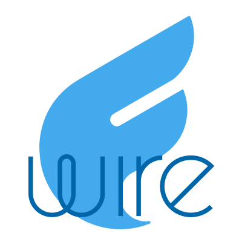

# flightphp-wire



Convenzioni di progetto condivise fra i siti basati su [FlightPHP](https://flightphp.com/):

- `core\Bootstrap` inizializza l'engine Flight (path dei controller, config da `data/config.json`, censimento controller, registrazione route).
- `core\controllers\BaseController` / `BaseWebController` / `BaseApiController` sono le classi base da cui estendere i controller del sito; il tipo di classe base determina la classificazione automatica (web vs API).
- `core\attributes\Route` è l'attributo PHP con cui annotare i metodi dei controller per dichiarare path, verbo HTTP, middleware e metadati OpenAPI.
- `core\helpers\ControllerScanner`, `AttributeRouteRegistrar` e `OpenApiGenerator` gestiscono rispettivamente il censimento dei controller, la registrazione delle route e la generazione dello spec OpenAPI.
- `core\helpers\Session` è registrata come servizio Flight `session` (istanza unica e lazy: `$this->session()` nei controller). Legge la sessione senza tenerne il lock (`read_and_close`), non la avvia se il browser non ha il cookie e scrive solo con `commit()`; `regenerate()` rigenera l'id al commit (da usare dopo il login). Opzioni di default: cookie `SESS_ID`, `HttpOnly`, `SameSite=Lax`, `Secure` se in HTTPS.
- La config del sito (`data/config.json`) viene sovrapposta con merge ricorsivo a quella di default della libreria (`src/config/default.json`): il sito scrive solo i propri valori (`BASEURL`, `APIKEYS`, `API_INFO.title`/`description`/`contactEmail`, credenziali `OAUTHS.CFG.<Provider>.clientID`/`clientSecret`, ...) e può sovrascrivere qualunque default. I default comprendono `API_INFO` (titolo, descrizione e versione generici; `securitySchemes`/`defaultSecurity` vanno dichiarati dal sito) e gli endpoint dei provider OAuth (Google, Github, Gitlab, Yahoo, Microsoft, Facebook, Dropbox, Erebox); un provider è attivo solo se il sito ne imposta `clientID` e `clientSecret`.
- `core\controllers\BaseOAuthController` fornisce il login OAuth2: il controller del sito che la estende eredita le route `GET /auth/@provider` (avvia il login: genera lo `state` anti-CSRF, lo salva in sessione e reindirizza al provider) e `GET|POST /auth` (callback: verifica lo `state`, scambia il code con il token e legge il profilo), e implementa solo `onOAuthLogin($provider, $user)` (`$user` = `email`, `name`, `avatar`, `raw`). Opzionali: `onOAuthError()`, `oauthReturnPath()`, `oauthRedirectUri()`, `oauthProviders()`. I provider sono letti da config `OAUTHS.CFG.<Provider>` (`clientID`, `clientSecret`, `urlAuth` con i segnaposto `{clientID}`/`{redirectUri}`, `urlAccessToken`, `urlUserInfo`); il redirect URI da registrare presso i provider è `<schema>://<host>/auth`. La logica verso i provider è in `core\helpers\OAuth`.
- `core\middlewares\WebHeader` e `ValidateApikey` sono i middleware di default applicati rispettivamente alle route web e API.
- `BaseWebController::renderPageLinks($title, $controllerClass = null)` renderizza una pagina con i link alle pagine del controller (di default quello corrente); `pageLinks($controllerClass)` restituisce lo stesso elenco come array. Sono incluse solo le route `GET` senza parametri di path e non marcate `hidden`; l'etichetta è il `summary` della route (o il path). La vista `links.html` è quella del sito se presente in `app/views`, altrimenti quella di default della libreria.
- `core\controllers\DefaultRouteController` fornisce le route di default: `/` (homepage), `/api` (Swagger UI) e `/api/openapi` (spec generata). `Bootstrap::init` le registra sempre, ma salta quelle il cui path+metodo è già dichiarato da un controller del sito: un sito può quindi sovrascrivere una singola route (es. solo `/`) senza perdere le altre. Le viste `index.html`/`swagger.html` sono quelle del sito se presenti in `app/views`, altrimenti vengono usate quelle di default incluse nella libreria (`src/views`).

## Installazione

```bash
composer require erebox/flightphp-wire
```

## Uso

Nel file iniziale del sito (es. `index.php`):

```php
require 'vendor/autoload.php';
use core\Bootstrap;

$app = Bootstrap::init(__DIR__.'/app', 'app\\controllers');
$app->start();
```

`Bootstrap::init` si aspetta la convenzione comune ai siti: controller in `app/controllers` (che estendono `BaseWebController`/`BaseApiController`), route dichiarate con l'attributo `Route`, config in `data/config.json`.
